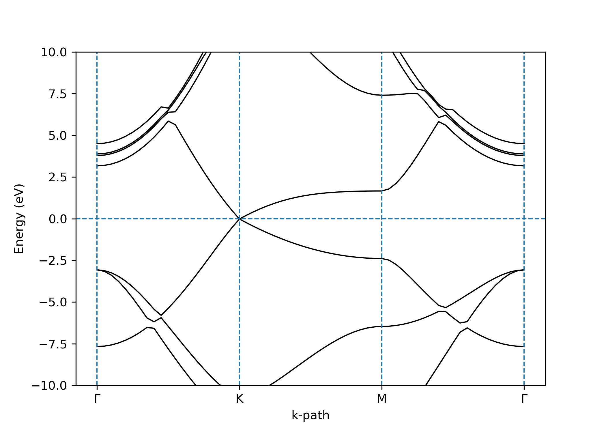
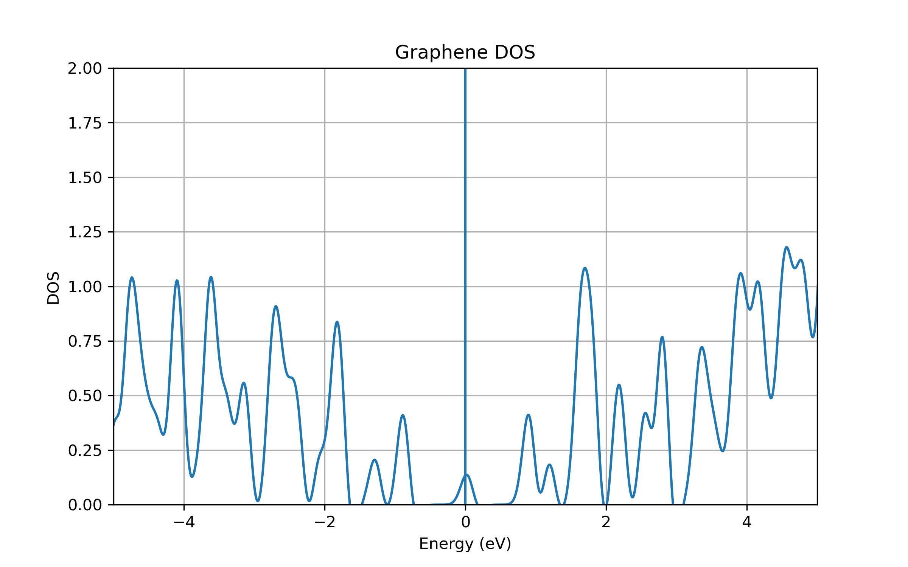

# Graphene Electronic Structure using Quantum ESPRESSO

## Overview
This project presents a Density Functional Theory (DFT) study of graphene using Quantum ESPRESSO.  
The electronic properties of graphene are analyzed through band structure and density of states (DOS).

---

## Objectives
- Perform SCF and NSCF calculations
- Compute Density of States (DOS)
- Calculate band structure along high-symmetry path
- Verify graphene’s semimetallic nature

---

## Methodology

### 1. SCF Calculation
- Determines ground-state charge density
- K-points: 12 × 12 × 1

### 2. NSCF Calculation
- Used for DOS and band calculations
- K-points: 18 × 18 × 1

### 3. DOS Calculation
- Energy range: -10 eV to 10 eV
- Smearing used for smoother DOS

### 4. Band Structure
- High-symmetry path: Γ → K → M → Γ

---

## Results

### Band Structure
- Linear band crossing at K-point (Dirac cone)
- No band gap observed
- Confirms graphene as a **zero-gap semimetal**

### Density of States (DOS)
- DOS approaches zero at Fermi level
- Symmetric distribution around Fermi energy

---

## Plots

### Band Structure

### Density of States

---

## Folder Structure
graphene/
├── inputs/ # QE input files
├── outputs/ # QE output logs
├── data/ # DOS and band data
├── plots/ # Final plots
├── scripts/ # Python plotting scripts
├── pseudo/ # Pseudopotential files

## Tools Used
- Quantum ESPRESSO
- Python (NumPy, Matplotlib)
- WSL (Linux environment)

---

## Key Insights
- Graphene exhibits Dirac cone at K-point
- Zero density of states at Fermi level
- Electronic structure matches theoretical expectations

---

## Future Work
- Vacancy defect in graphene
- Nitrogen/Boron doping
- Surface adsorption using Lithium

---

## Author
Sujoy Das
